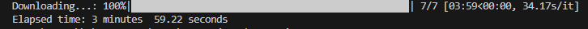

# Excercise1 - Downloading Files

The first exercise tests your ability to download a number of files from an HTTP source and unzip them, storing them locally with Python using `various methods` and approach.

## Problems Statement

You need to download 10 files that are sitting at the following specified
`HTTP` urls. You will use the `Python` package `requests` to do this
work.

You will need to pull the filename from the download uri.

The files are `zip` files that will also need to be unzipped into
their `csv` format.

They should be downloaded into a folder called `downloads` which
does not exist currently inside the `Exercise-1` folder. You should
use `Python` to create the directory, do not do it manually.

### Generally, your script should do the following

1. create the directory `downloads` if it doesn't exist
2. download the files one by one.
3. split out the filename from the uri, so the file keeps its
   original filename.

4. Each file is a `zip`, extract the `csv` from the `zip` and delete
the `zip` file.
5. For extra credit, download the files in an `async` manner using the
   `Python` package `aiohttp`. Also try using `ThreadPoolExecutor` in
   `Python` to download the files. Also write unit tests to improve your skills.

### Project WorkFlow

To challenge myself, and see which method is faster, i broke down this project into Four Section

1. Using average *`For-loop`* to download the files -> [Find Code Here](ForLoopScript.py)
2. Using *`Request Streaming mode`* and the concept of *`resumable download`* if any interruption occurs -> [Find Code Here](RequestStreaming.py)
3. Using *`ThreadPoolExecutor`* to download the files `concurrently` -> [Find Code Here](ThreadPool.py)
4. Using *`async`* to download the files `asynchronously` -> [Find Code Here](Asyncio.py)

### Using Synchrousnous For-Loop: [Find Code Here](ForLoopScript.py)

- In order to create the directories and work with files and system operations, I used the *`OS Libary`*
- Picked up the *`Zipfile Libary`* to extract and work with Zipfiles
- Made provision for *`Try&Except`* just incase not all urls are valid - which i was right
- Employed *`tqdm Libary`* for progression bar - To monitor the progress of the download
- Employed adequate logging by printing out each section of a process *`Extracting & Deleting Zip File`, `Downloading`, `Downloaded file`* and so on.
- logged the *`Elapsed time`* the script ran for - **`3 minutes  59.22 seconds`** **`Roughly 4 Minutes`**

### Using Streaming Mode + Resumable Download: [Find Code Here](RequestStreaming.py)

> **Streaming** in the context of `requests.get` refers to the ability to retrieve content from a remote server incrementally,  rather than loading the entire response content into memory all at once. Streaming can be useful when dealing with large files or when you want to process the response content piece by piece without loading everything into memory.

- Made provision to *Resume Download* and not start from scratch incase any interruption occurs
- Employed the *Streaming feature* of `request.get` to load and process the content in chunks instead of loading them all at once to memory
- Employed `Os, tqdm, zipfile, try&except` like i did in the `For-Loop` use case

- 

- The Script ran for **`5 minutes, 51.79 Seconds`** which is slower than `ForLoop Script` **whys that?**

> This is because script performs several tasks per iteration before downloading the file. Here's a breakdown of these tasks:

1. **File Existence Check**: The script checks if the file already exists.
2. **Download Completion Check**: It verifies if the file has been downloaded completely.
3. **Resume Download**: If the file exists but is not complete, the script resumes the download by comparing the already downloaded file size to the content header size.

These processes collectively contribute to the extra 2 minutes added to the script's runtime. However, an important question arises: *Is sacrificing download speed for the ability to resume downloads the right choice?*

The answer may vary depending on individual preferences. However, i believe the decision should be influenced by the size of the file one is working with.

If it is a Large File, implementing the resume download feature can be highly beneficial as it prevents the need to start the download from scratch

- 

- The Script ran for **`5 minutes, 51.79 Seconds`** which is slower than `ForLoop Script` **whys that?**

> This is because script performs several tasks per iteration before downloading the file. Here's a breakdown of these tasks:

1. **File Existence Check**: The script checks if the file already exists.
2. **Download Completion Check**: It verifies if the file has been downloaded completely.
3. **Resume Download**: If the file exists but is not complete, the script resumes the download by comparing the already downloaded file size to the content header size.

These processes collectively contribute to the extra 2 minutes added to the script's runtime. However, an important question arises: *Is sacrificing download speed for the ability to resume downloads the right choice?*

The answer may vary depending on individual preferences. However, i believe the decision should be influenced by the size of the file one is working with.

If it is a Large File, implementing the resume download feature can be highly beneficial as it prevents the need to start the download from scratch

### Using Multithreading with (ThreadPoolExecutor): [Find Code Here](ThreadPool.py)

For this script i would be using the `ThreadPoolExecutor` to download the files **concurrently** without `Resumable Download` -> This approach makes use of multithreading to decrease the overall time of the download.

When using `ThreadPoolExecutor`, the tasks run in parallel threads, which means that multiple files can be downloaded simultaneously. This significantly reduces the time it takes to complete the entire operation because the CPU can work on different tasks simultaneously.

Using this approach was able to reduce the time to download the files by 5x.. Tweaking from 4minutes to 1 minutes 19 Seconds. Thats Slick if you'd ask me. Using multithreading to get things done might just be it for me!

All i did was refactor my script to download a single file instead of iterating over it. Then i mapped the list of urls to the ThreadPoolExecutor and voila. The work workload in carried out by the **executor**.

### Using  Asynchronous programming with (Asyncio & Aiohttp): [Find Code Here](Asyncio.py)

> In traditional (synchronous) programming, when your code performs an operation like reading a file or making a network request, it often has to wait for that operation to finish before moving on to the next task. This can make your program slow and unresponsive, especially when dealing with multiple tasks. **This is the Case with the [ForLoop Script](ForLoopScript.py)**
> Asyncio is a Python library that introduces the concept of asynchronous programming. It allows your program to efficiently handle multiple tasks at the same time without waiting for each task to complete. Instead, it switches between tasks while they're waiting for something to happen, like reading data from a file or waiting for a network response. This keeps your program responsive and efficient.

Like ThreadPoolExecutor, Asyncio also concurrently perform multiple tasks without waiting for each task to finish. However, it uses a single Thread and cooperative multitasking to get the job done. While ThreadPoolExecutor uses multiple threads (multithreading)

Now lets see which one is faster. ThreadPoolExecutor or Asyncio?

Asyncio script ran for 1 minutes 24 Seconds. Making the ThreadPoolExecutor a bit faster with few seconds lead.

Usually, Asyncio should be faster in the context I/O bound tasks like this project (downloading files from external URLs). I reckon the ThreadPoolExecutor script was faster due to the extra CPU task of unzipping and deleting the zip file in the script. Regardless, we can see the power of using the concurrency approach.

**and with that, we come to an end to this exercise! See you in the [next](../Exercise-2/)**
