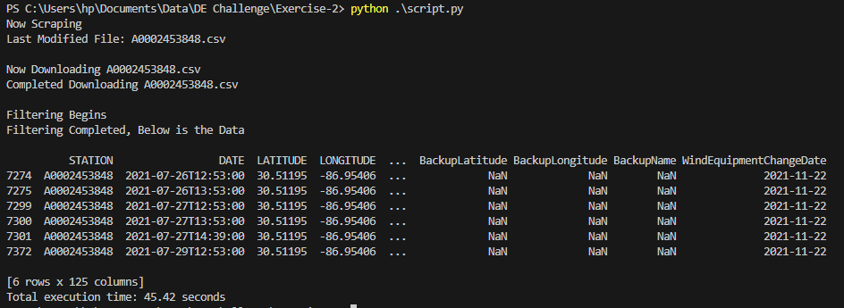

# Excercise-2: Web Scraping + Downloading + Pandas

In this second exercise you will practice your Python skills again, we will extend upon the idea of downloading files from `HTTP` sources with Python, but add a twist.

You will have to "web scrap" a `HTML` page looking for a date, and identifying the correct file to build a URL with which you can download said file.

## Table of Content

- [Problem Statement](#problems-statement)
- [Project Workflow](#project-workflow)
- [Solution](#the-script---find-code-here)

## Problems Statement

You need to download a file of weather data from a government website.
files that are sitting at the following specified location.

<https://www.ncei.noaa.gov/data/local-climatological-data/access/2021/>

You are looking for the file that was `Last Modified` on `2022-02-07 14:03`, you
can't cheat and lookup the file number yourself. You must use Python to scrape
this webpage, finding the corresponding file-name for this timestamp, `2022-02-07 14:03`

Once you have obtained the correct file, and downloaded it, you must load the file
into `Pandas` and find the record(s) with the highest `HourlyDryBulbTemperature`.
Print these record(s) to the command line.

## Project Workflow

1. Web scrap/pull down the contents of `https://www.ncei.noaa.gov/data/local-climatological-data/access/2021/`
2. Analyze it's structure, determine how to find the corresponding file to `2022-02-07 14:03` using Python.
3. Build the `URL` required to download this file, and write the file locally.
4. Open the file with `Pandas` and find the records with the highest `HourlyDryBulbTemperature`.
5. Print this to stdout/command line/terminal.

## The Script -> [find code here](./script.py)

The script is organized into three functions, each dedicated to a specific task within the project:

1. **Scrape Website**: The `scrape` function fetches data from a specified website, searches for specific information, and identifies the last modified file based on a timestamp.

2. **Download File**: The `download_file` function is responsible for downloading the last modified file from the web using the file name obtained during the scraping process.

3. **Transform Data**: The `transform` function processes the downloaded file, filtering and analyzing the data, with a specific focus on identifying the highest temperature records.

This structured approach makes the code modular and easy to maintain, allowing each function to focus on a single distinct aspect of the project.

Below is the log from the script

## Challenges

The main challenge was in the scraping phase of the project, understanding the structure and parsing it to find a specific information was a pain in the youknowwhat, which i enjoyed btw. The rest of the process was a breeze.
