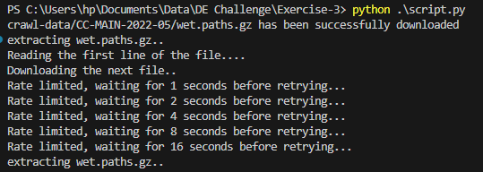

# Exercise #3 - Boto3 AWS + s3 + Python

In this third exercise you will practice your Python skills again, we will extend upon the idea of downloading files and start by retrieving files from an `s3` cloud bucket on `aws` in a multi-step process.

Working with the `Python` package `boto3` to interact with `aws` is very common, and this will ensure you get an introduction to that topic.

## Table of Content

- [Problem Statement](#problems-statement)
- [Project Workflow](#project-workflow)
- [Solution](#solution)

## Problems Statement

AWS puts out some "common crawl" web data, available on `s3` with no special permissions needed. http://commoncrawl.org/the-data/get-started/

Your task is two-fold, download a `.gz` file located in s3 bucket `commoncrawl` and key `crawl-data/CC-MAIN-2022-05/wet.paths.gz` using `boto3`.

Once this file is downloaded, you must extract the file, open it, and download the file uri located on the first line using `boto3` again. Store the file locally and iterate through the lines of the file, printing each line to `stdout`.

## Project Workflow

Generally, your script should do the following ...

1. `boto3` download the file from s3 located at bucket `commoncrawl` and key `crawl-data/CC-MAIN-2022-05/wet.paths.gz`
2. Extract and open this file with Python (hint, it's just text).
3. Pull the `url` from the first line of this file.
4. Again, download the that `uri` file from `s3` using `boto3` again.
5. Print each line, iterate to stdout/command line/terminal.

### **Extra Credit:**

- DO NOT load the entire final file into memory before printing each line,
stream the file.
- DO NOT download the initial `gz` file onto disk, download, extract, and read it in memory.

## Solution

The script is broken down into 3 functions: -> The name are pretty straightword and you should understand what they do, right off.

- `download_file`: uses boto3 resource `download_file` method to download the file to disk.
- `extract_gz`: extracts the file zip downloaded
- `read_file`: reads the extracted file and retrieve the first line to be extracted all over again.

I keep encountering the error `(reached max retries: 4): Please reduce your request rate.` -> this error has to do with the s3 max request limit and to overcome it i implemented a backoff strategy that timeouts and sleep the code for some time before making another request.

This solution doesn't contain the [Extra Credit aspect](#extra-credit). that will be updated later..