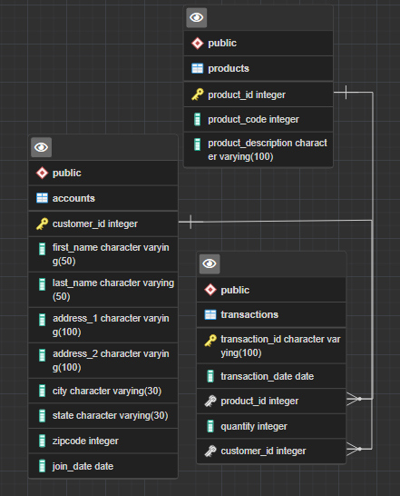

# Exercise #5 - Data Modeling for Postgres + Python

In this fifth exercise you will work on a few different topics, data modeling, Python, and Postgres. These are common problems worked on in data engineering.

## Table of Content

- [Problem Statement](#problems-statement)
- [Project Workflow](#project-workflow)
- [Solution](#solution)

## Problems Statement

There is a folder called `data` in this current directory, `Exercises/Exercise-5`. There are also
3 `csv` files located in that folder. Open each one and examine it, the  first task is to create a `sql` script with the `DDL` to hold a `CREATE` statement for each data file. Remember to think about data types. Also, this `CREATE` statements should include indexes for each table, as well as primary and foreign keys.

After you have finished this `sql` scripts, we must connect to `Postgres` using the `Python` package
called `psycopg2`. Once connected we will run our `sql` scripts against the database.

Finally, we will use `psycopg2` to insert the data in each `csv` file into the table you created.

## Project Workflow

Generally, your script should do the following:

1. Examine each `csv` file in `data` folder. Design a `CREATE` statement for each file.
2. Ensure you have indexes, primary and forgein keys.
3. Use `psycopg2` to connect to `Postgres` on `localhost` and the default `port`.
4. Create the tables against the database.
5. Ingest the `csv` files into the tables you created, also using `psycopg2`

## Architectural Diagram of the DB

## Solution

I studied the csv file and designed the DB to have indexes, primary and foreign key where it ought to -> find the DDL sql script [here](./script.sql)

The [Python Script](./script.py) consist of 6 functions each playing an independent role in the whole architecture.

1. `connect`: to connect to the DB
2. `execute_query`: just as the name says, to run sql queries
3. `schema_script`: to read the DDL SQL file and run it against the DB
4. `ingest_accounts`: to ingest data from the csv file into the account table
5. `ingest_products`:
6. `ingest_transformations`:

tried to run this code to ingest csv files into the tables `COPY accounts FROM 'C:/Users/hp/Documents/Data/DE Challenge/Exercise-5/data/accounts.csv' DELIMITER ',' CSV` but i got the error below.
> ERROR:  could not open file "C:/Users/hp/Documents/Data/DE Challenge/Exercise-5/data/accounts.csv" for reading: Permission denied
HINT:  COPY FROM instructs the PostgreSQL server process to read a file. You may want a client-side facility such as psql's \copy.

Apparently, this kind of operation (reading a file) needs the power of the psql cli to execute.

Out of curiocity i ran the code in psql cli and it worked.

`\copy accounts FROM 'C:/Users/hp/Documents/Data/DE Challenge/Exercise-5/data/accounts.csv' (format csv, header true, delimiter ',');`

I'd say the psql cli `\COPY` feature is pretty straight forwarding than the python pyscopg2, but we all know working in the command line isn't as preety as the feature it provides :)
